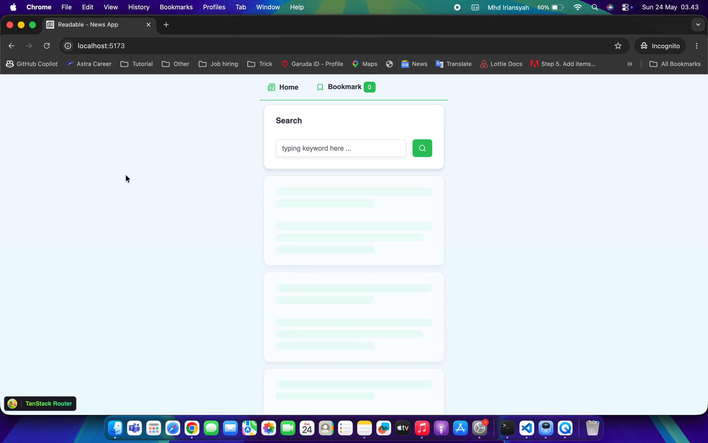

# 👉 Blamescope

<div align="center">

</div>

Component-level git blame overlay for React + Vite projects.

Hover over any React component in your browser during development to instantly see who last touched it, when, and what the commit message was — without leaving your app.

[](https://www.npmjs.com/package/@pace11/blamescope)
[](https://github.com/pace11/blamescope/actions/workflows/publish.yml)
[](https://npm-stat.com/charts.html?package=%40pace11%2Fblamescope)

<div align="center">
  
</div>

## How it works

1. **Vite plugin** — auto-injects a `data-blamescope` attribute onto the root JSX element of every React component at build time (dev only).
2. **Local server** — a small Express server on port `4317` queries `git log` for a given file and returns blame metadata.
3. **`<BlameOverlay />`** — a React component that listens to `mousemove`, finds the nearest `data-blamescope` element, calls the local server, and renders a tooltip with author, date, commit message, contributor list, and a clickable commit hash that links to the remote commit.

## Installation

```bash
npm install -D @pace11/blamescope
```

> **Peer requirements:** React ≥ 18, Vite ≥ 5. Your project must be a git repository.

## Setup

### 1. Add the Vite plugin

In `vite.config.ts`, add `blameScopePlugin()` **before** the React plugin:

```ts
// vite.config.ts
import { defineConfig } from 'vite'
import react from '@vitejs/plugin-react'
import { blameScopePlugin } from 'blamescope/plugin'

export default defineConfig({
  plugins: [blameScopePlugin(), react()],
})
```

### 2. Mount `<BlameOverlay />`

Render `<BlameOverlay />` once near the root of your app (e.g. in `App.tsx`):

```tsx
import { BlameOverlay } from '@pace11/blamescope'

export default function App() {
  return (
    <>
      {/* your app ... */}
      {import.meta.env.DEV && <BlameOverlay />}
    </>
  )
}
```

Wrapping it in `import.meta.env.DEV` ensures it is never shipped to production.

### 3. Start the blame server

Run the blamescope server alongside your Vite dev server:

```bash
# in one terminal
npx blamescope

# in another terminal
vite
```

Or add both to a single npm script:

```json
"scripts": {
  "dev": "blamescope & vite"
}
```

## Usage

- **Hover** over any component in the browser — a tooltip appears with:
  - Latest commit message, author, and relative date
  - Commit hash (clickable — opens the commit on GitHub/GitLab/Bitbucket in a new tab)
  - Total commits and contributor breakdown
- **Hold `Alt`** to pin the tooltip so you can select and copy text.
- **Press `Escape`** to unpin.
- A **status banner** is always visible at the bottom center of the window indicating blamescope is active.

## Manual annotation with `withBlame`

The Vite plugin auto-detects named function components. For components it cannot reach (anonymous functions, `React.forwardRef`, etc.), use the `withBlame` HOC:

```tsx
import { withBlame } from '@pace11/blamescope'

const Button = withBlame(
  React.forwardRef<HTMLButtonElement, ButtonProps>((props, ref) => (
    <button ref={ref} {...props} />
  )),
  { file: 'src/components/Button.tsx', component: 'Button' }
)
```

## API

### `blameScopePlugin(root?: string)`

Vite plugin. Accepts an optional `root` path (defaults to `process.cwd()`). Must be placed **before** the React plugin in the `plugins` array.

### `<BlameOverlay />`

React component. Renders the status banner and hover tooltip. Mount once per app.

| Prop | Type | Default | Description |
|---|---|---|---|
| `theme` | `ThemeName \| BlameTheme` | `"default"` | Preset theme name or a custom theme object |

#### Preset themes

| Name | Inspired by |
|---|---|
| `"default"` | Dark blue-grey |
| `"github"` | GitHub dark |
| `"gitlab"` | GitLab dark |
| `"bitbucket"` | Bitbucket dark |
| `"aws"` | AWS Console dark |
| `"google"` | Google Material dark |

```tsx
// use a preset
<BlameOverlay theme="github" />

// or define a fully custom theme
import type { BlameTheme } from '@pace11/blamescope'

const myTheme: BlameTheme = {
  background: '#1a1a1a',
  backgroundSecondary: '#2a2a2a',
  border: '#333',
  borderPinned: '#ff6b6b',
  text: '#fff',
  textMuted: '#aaa',
  textFaint: '#666',
  accent: '#ff6b6b',
  pinActive: '#ff6b6b',
}

<BlameOverlay theme={myTheme} />
```

### `withBlame(Component, meta)`

Higher-order component for manual annotation.

| Param | Type | Description |
|---|---|---|
| `Component` | `ComponentType<P>` | The component to wrap |
| `meta.file` | `string` | Relative path to the source file |
| `meta.component` | `string` | Display name shown in the tooltip |

### Blame server

The server listens on `http://localhost:4317` and exposes:

```
GET /ownership?file=<relative-path>
```

Returns JSON with `latestCommit`, `latestAuthor`, `latestDate`, `commitHash`, `commitUrl`, `latestEmail`, `totalCommits`, and `contributors`.

- `commitUrl` — full URL to the commit on the remote (e.g. `https://github.com/user/repo/commit/<hash>`). `null` if no remote is configured.

## Notes

- The overlay and plugin are intended for **development only**. Do not include them in production builds.
- The project must have a git history; the server calls `git log` and `git shortlog` under the hood.
- The server only accepts relative paths and rejects path-traversal attempts.

## Current limitations

Blamescope v0.1 only supports **React + Vite** projects. The Vite plugin relies on Babel to parse JSX/TSX and MagicString to inject attributes, so it is tightly coupled to the Vite build pipeline. Other setups are not supported yet.

## Roadmap

The following integrations are planned for future releases:
- **Remix / React Router v7** — same plugin approach adapted for Vite-based Remix projects (Can be used almost directly, with little to no modification ✅)
- **Next.js** — webpack/Turbopack plugin variant that injects `data-blamescope` during the Next.js build ⏳
- **Vue 3** — Vite plugin that injects blame attributes on the root element of single-file components (`.vue`) ⏳
- **Svelte** — preprocessor that annotates component root nodes ⏳
